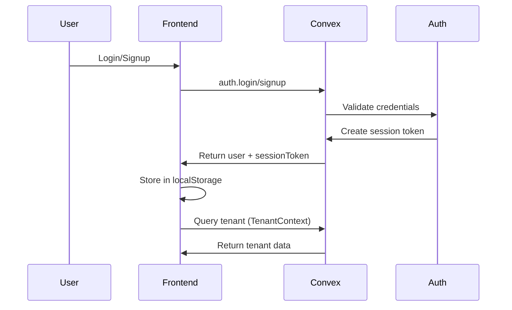
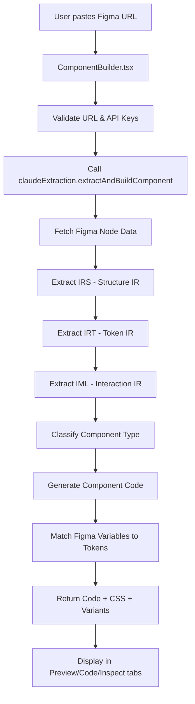
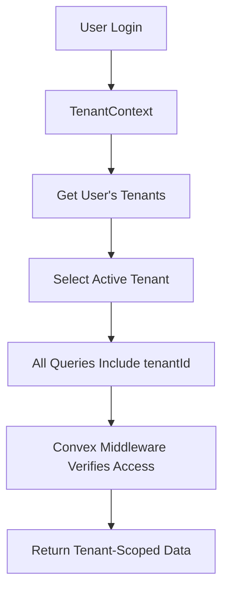
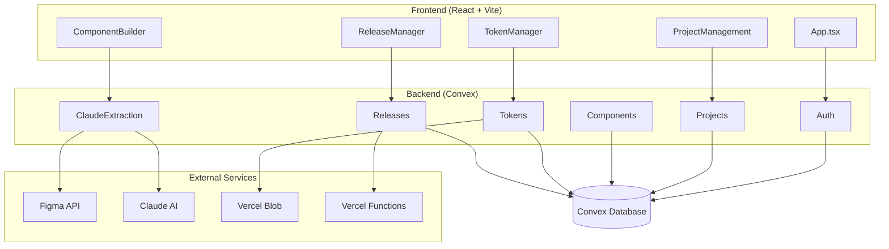

# DS-OS: Complete End-to-End Analysis

## 📋 Project Overview

**DS-OS (Design System Operating System)** is a multi-tenant SaaS platform that converts Figma designs into production-ready, accessible React components. It's built as a full-stack application with real-time data synchronization.

### Core Value Proposition

- Extract components from Figma designs using AI (Claude/Gemini)
- Generate production-ready React/TypeScript code
- Manage design tokens (colors, typography, spacing, etc.)
- Multi-tenant architecture with RBAC
- Real-time collaboration via Convex reactive database

---

## 🏗️ Architecture & Tech Stack

### Frontend Stack

- **Framework**: React 19 with TypeScript
- **Build Tool**: Vite 6.2.0
- **Styling**: Tailwind CSS v4
- **State Management**: Convex React (reactive queries)
- **Code Editor**: Monaco Editor
- **Live Preview**: Sandpack (CodeSandbox)
- **Icons**: Lucide React
- **Routing**: Client-side routing (SPA)

### Backend Stack

- **Database**: Convex (reactive database)
- **Runtime**: Node.js (Convex functions)
- **API**: Convex Actions (for external API calls)
- **Storage**: Vercel Blob Storage (for token bundles, screenshots)

### External Services

- **Figma API**: Component extraction
- **Claude AI**: Component code generation
- **Google Gemini**: Alternative AI code generation
- **Vercel**: Hosting + serverless functions

### Development Tools

- **Storybook**: Component documentation
- **Playwright**: Visual diff testing
- **axe-core**: Accessibility testing
- **Vitest**: Testing framework

---

## 🔄 How It Works: Data Flow

### 1. Authentication Flow



**Key Files:**

- `src/components/Login.tsx` - Login UI
- `convex/auth.ts` - Authentication logic
- `src/contexts/TenantContext.tsx` - Tenant management

### 2. Component Extraction Flow



**Key Files:**

- `src/components/ComponentBuilder.tsx` - Main UI
- `convex/claudeExtraction.ts` - Extraction pipeline
- `convex/irsExtraction.ts` - Structure extraction
- `convex/irtExtraction.ts` - Token extraction
- `convex/imlExtraction.ts` - Interaction extraction
- `convex/codeGenerator.ts` - Code generation

### 3. Token Management Flow

```mermaid
flowchart LR
    A[Upload JSON File] --> B[Parse Tokens]
    B --> C[Store in tokenFiles table]
    C --> D[Extract Individual Tokens]
    D --> E[Store in tokens table]
    E --> F[Generate Token Bundle]
    F --> G[Upload to Vercel Blob CDN]
    G --> H[Return CDN URLs]
    H --> I[Use in Components]
```



**Key Files:**

- `src/components/TokenManager.tsx` - Token UI
- `convex/tokenFiles.ts` - File management
- `convex/tokens.ts` - Token CRUD
- `convex/tokenCompiler.ts` - Token compilation
- `convex/tokenBundles.ts` - Bundle generation

### 4. Multi-Tenant Data Isolation



**Key Files:**

- `convex/tenantMiddleware.ts` - Access verification
- `convex/schema.ts` - All tables have tenantId
- `src/contexts/TenantContext.tsx` - Tenant provider

---

## ✅ What's Working

### 1. Authentication & User Management ✅

- Email/password authentication
- Google OAuth login
- GitHub OAuth login
- Session management with secure tokens
- Email verification flow (UI ready)
- Rate limiting on auth attempts

**Status**: Fully functional

### 2. Multi-Tenant Architecture ✅

- Complete tenant isolation at schema level
- Automatic personal tenant creation
- Role-Based Access Control (RBAC)
- Tenant-scoped queries
- Tenant middleware for access verification

**Status**: Production-ready

### 3. Project Management ✅

- Full CRUD operations
- Project member management
- Role assignment (Owner, Admin, Editor, Viewer)
- Project deletion with confirmation
- Two-level navigation (Project Selector → Workspace)

**Status**: Fully functional

### 4. Component Builder ✅ (~95% Functional)

- Figma URL validation
- Component extraction from Figma
- IR extraction (IRS, IRT, IML)
- Code generation (TypeScript + CSS)
- Live preview (Sandpack)
- Code editor (Monaco)
- Component saving
- Variant handling

**Status**: Core functionality working, edge cases need testing

#### IR System Status:

**IRS (Structure IR)** - ✅ **100% Implemented**

- ✅ Complete node tree extraction
- ✅ Layout properties (auto-layout, constraints, spacing, alignment)
- ✅ Visual properties (fills, strokes, effects, opacity, radii)
- ✅ Typography extraction (font family, size, weight, line height, letter spacing)
- ✅ Variant matrix extraction with state mapping
- ✅ Slot detection via naming conventions
- ✅ Layout intent extraction (HUG/FILL/FIXED → intrinsic/fluid/fixed)
- ✅ CSS hints for workarounds (pseudo-elements, masks, filters)
- ✅ Vector paths and text path support
- ⚠️ **Needs real-world testing** with complex components

**IRT (Token IR)** - ✅ **100% Implemented**

- ✅ Semantic token mapping from Figma variables
- ✅ **Full alias resolution** (handles chains of aliases)
- ✅ Multi-mode token support (light/dark/high-contrast)
- ✅ Token dependency graph construction
- ✅ Token usage tracking across nodes
- ✅ Automatic semantic naming inference
- ✅ Token type detection (color, spacing, typography, sizing, radius, shadow)
- ✅ Duplicate/alias detection
- ⚠️ **Needs real-world testing** with complex variable structures

**IML (Interaction IR)** - ✅ **100% Implemented**

- ✅ Component state extraction (default, hover, pressed, focus, disabled)
- ✅ ARIA mappings (role, labels, describedBy, controls, etc.)
- ✅ Keyboard mappings (Enter, Escape, Arrow keys, etc.)
- ✅ Interaction rules (onClick, onFocus, onBlur, state transitions)
- ✅ Component category detection (20+ categories)
- ✅ Required primitives detection (Radix UI)
- ⚠️ **Needs real-world testing** with various component types

**Summary**: All three IR systems are **fully implemented** with comprehensive feature coverage. However, they need **real-world testing** to verify they work correctly with actual Figma components, especially edge cases like:

- Complex nested components
- Vector graphics rendering
- Text on path
- Complex gradients with transforms
- Multi-mode token aliases

#### ⚠️ **CRITICAL GAP: Schema Validation NOT Enforced**

**Status**: ❌ **No Runtime Schema Validation**

**Current State**:

- ✅ TypeScript interfaces defined in `src/types/ir.ts`
- ✅ Compile-time type checking (TypeScript)
- ❌ **No runtime validation** against schemas
- ❌ No validation library (Zod, Yup, Ajv, etc.) in use
- ❌ Extraction functions return objects without validation

**What's Missing**:

1. **No StructureSchema validation** - `extractIRS()` returns IRS object without validation
2. **No TokenSchema validation** - `extractIRT()` returns IRT object without validation  
3. **No InteractionSchema validation** - `extractIML()` returns IML object without validation

**Documentation Mentions** (but NOT implemented):

- `docs/guides/Unified_Blueprint.md` line 310: "Use `ajv` to validate IRS/IRT/IML"
- `docs/guides/Implementation_Plan.md` line 73: "Validate with JSON Schema"

**Risks**:

- Invalid IR objects can propagate through the pipeline
- Errors only surface during code generation (late failure)
- No early detection of malformed data
- TypeScript types don't catch runtime data issues

**Recommendation**: Add runtime schema validation using Zod or Ajv to validate IRS, IRT, and IML objects after extraction.

### 5. Token Manager ✅

- JSON file upload and parsing
- Multiple file management
- Token visualization (colors, typography, spacing)
- Multi-mode support (light/dark)
- Token dependency graph
- Font file upload
- Token bundle generation with CDN

**Status**: Fully functional

#### Token Layering Architecture Status:

**1. Global Tokens (Rarely Change)** - ✅ **Implemented**

- ✅ `compileGlobalTheme` action compiles all project tokens
- ✅ `useThemeTokens` hook loads global theme bundle
- ✅ Global bundles stored in `tokenBundles` with `type: "global"`
- ✅ CSS variables generated in `:root` and mode-specific selectors
- ✅ CDN storage with fallback to database
- ✅ Multi-mode support (light/dark/high-contrast)

**2. Semantic Tokens (Medium Churn)** - ⚠️ **Partially Implemented**

- ✅ IRT extraction creates `SemanticToken[]` with semantic names
- ✅ Semantic naming inference (`inferSemanticName` in `irtExtraction.ts`)
- ✅ Token dependency graph tracks relationships
- ❌ **No separate storage layer** - semantic tokens stored in same `tokens` table as global
- ❌ **No semantic token bundle** - semantic tokens are mixed with global tokens
- ❌ **No semantic layer compilation** - semantic tokens compiled into global bundle

**3. Component Tokens (High Churn)** - ✅ **Implemented**

- ✅ `compileComponentTokens` action extracts tokens used by components
- ✅ `useComponentTokens` hook loads component-specific bundles
- ✅ Component bundles stored with `type: "component"` and `componentId`
- ✅ Only tokens referenced in component code are included
- ✅ Minimal JSON bundles (not full CSS)
- ✅ CDN storage with fallback

**4. Instance Overrides (Runtime Only)** - ❌ **Not Implemented**

- ❌ No runtime token override mechanism
- ❌ No instance-level token override system
- ❌ Variants exist but don't override tokens at instance level
- ❌ No prop-based token override (e.g., `<Button color="custom">`)

**Summary**:

- ✅ **Global tokens**: Fully implemented
- ⚠️ **Semantic tokens**: Conceptually present (IRT extraction) but not separated as a distinct layer
- ✅ **Component tokens**: Fully implemented
- ❌ **Instance overrides**: Not implemented

**Recommendation**:

1. Add semantic token layer separation (store semantic tokens separately or tag them)
2. Implement instance-level token overrides via component props
3. Add runtime token override mechanism for dynamic theming

### 6. Release Manager ✅

- Release creation and versioning
- Status tracking
- Changelog generation
- Component inclusion
- Pipeline visualization

**Status**: Fully functional

### 7. Activity Logging ✅

- Automatic activity tracking
- Activity feed with timeline
- Project-scoped activities

**Status**: Fully functional

---

## ⚠️ What's Not Working / Needs Fixing

### 1. Visual Diff Testing ⚠️

**Status**: Infrastructure ready, needs deployment

**What's Ready:**

- `convex/visualDiff.ts` - Actions defined
- `api/screenshot.ts` - Placeholder
- `api/image-diff.ts` - Placeholder
- Schema updated to store results

**What's Missing:**

- Vercel serverless function deployment
- Playwright screenshot service
- Pixelmatch image diff service
- Integration with approval workflow

**Fix Required:**

1. Deploy Vercel functions for screenshot and image-diff
2. Configure environment variables
3. Test with real components

### 2. Accessibility Testing ⚠️

**Status**: Infrastructure ready, needs deployment

**What's Ready:**

- `convex/accessibilityTesting.ts` - Actions defined
- `api/accessibility.ts` - Placeholder
- Schema updated to store results
- Packages installed (@axe-core/playwright)

**What's Missing:**

- Vercel serverless function deployment
- Integration with approval workflow

**Fix Required:**

1. Deploy accessibility service
2. Test with real components

### 3. Storybook Integration ⚠️

**Status**: Code generation ready, deployment pipeline missing

**What's Ready:**

- Storybook story generation in `codeGenerator.ts`
- Storybook configured in project
- StorybookViewer component

**What's Missing:**

- Deployment pipeline for Storybook
- Integration with component releases

**Fix Required:**

1. Set up Storybook deployment
2. Connect to component releases

### 4. MDX Documentation ⚠️

**Status**: Generator ready, Docusaurus setup missing

**What's Ready:**

- `convex/mdxGenerator.ts` - Complete generator
- Documentation structure defined

**What's Missing:**

- Docusaurus setup
- Deployment pipeline

**Fix Required:**

1. Set up Docusaurus
2. Connect MDX generation to deployment

### 5. Component Builder Edge Cases ⚠️

**Status**: Core working, edge cases need testing

**Needs Testing:**

- Vector graphics rendering
- Text on path rendering
- Complex gradients
- Blend modes
- Image fills
- Multiple variants

**Fix Required:**

1. Test with real Figma components
2. Fix any rendering issues found
3. Improve error handling

### 6. Environment Configuration ⚠️

**Status**: Partially configured

**Issues:**

- `VITE_CONVEX_URL` may not be set
- `BLOB_READ_WRITE_TOKEN` may be missing
- SSL certificate issues in development

**Fix Required:**

1. Create `.env.local` with required variables
2. Set up Vercel environment variables
3. Fix SSL issues (see `docs/FIX_FETCH_ERROR.md`)

### 7. Orphaned Records ⚠️

**Status**: Migration completed, some records may need fixing

**Issue:**

- Some activity records may be missing `tenantId`

**Fix Required:**

1. Run `migrations.fixOrphanedRecords.findOrphanedRecords`
2. Run `migrations.fixOrphanedRecords.fixOrphanedRecords`
3. Verify with `migrations.tenantMigration.verify`

---

## 🔴 Where Things Are Breaking

### 1. Convex Connection Issues

**Location**: `src/index.tsx`, `docs/FIX_FETCH_ERROR.md`

**Problem:**

- SSL certificate verification errors
- `TypeError: fetch failed` when connecting to Convex

**Solution:**

- Use `NODE_TLS_REJECT_UNAUTHORIZED=0` for development
- Or use existing Convex deployment URL
- See `docs/FIX_FETCH_ERROR.md` for details

### 2. Missing Environment Variables

**Location**: Throughout the app

**Problem:**

- `VITE_CONVEX_URL` not set → Frontend can't connect
- `BLOB_READ_WRITE_TOKEN` missing → Token bundles can't upload
- `GEMINI_API_KEY` missing → AI features won't work

**Solution:**

1. Create `.env.local`:
   ```env
   VITE_CONVEX_URL=https://your-project.convex.cloud
   GEMINI_API_KEY=your-key
   ```

2. Set in Vercel Dashboard for production
3. Set in Convex Dashboard for backend

### 3. Figma MCP Connection

**Location**: `src/services/figmaMcpClient.ts`

**Problem:**

- MCP server not running
- Figma desktop app not open
- Dev Mode not enabled

**Error Messages:**

- "Cannot connect to Figma MCP server"
- "Failed to fetch" errors

**Solution:**

1. Ensure Figma desktop app is running
2. Enable Dev Mode (Shift + D)
3. Enable MCP server in right sidebar
4. Open the file in Figma

### 4. Storybook Vitest Integration

**Location**: `debug-storybook.log`

**Problem:**

- Vitest setup failed during Storybook installation
- Vite config not updated automatically

**Solution:**

1. Manually configure Vitest in `vite.config.ts`
2. See Storybook documentation for manual setup

### 5. Component Preview Issues

**Location**: `src/components/ComponentBuilder.tsx`

**Potential Issues:**

- Sandpack preview may fail for complex components
- Missing dependencies in preview
- CSS not loading correctly

**Solution:**

1. Check Sandpack console for errors
2. Ensure all dependencies are included
3. Verify CSS is properly formatted

---

## 📊 System Architecture Diagram



---

## 🎯 Priority Fixes

### 🔴 Critical Priority (Do First)

1. **Add Runtime Schema Validation** ⚠️ **CRITICAL GAP**

**Why**: No validation of IRS/IRT/IML objects means invalid data can propagate silently

**Actions**:

   - Install Zod: `npm install zod`
   - Create schema validators in `convex/schemas/`:
     - `irsSchema.ts` - Validate IRS structure
     - `irtSchema.ts` - Validate IRT structure  
     - `imlSchema.ts` - Validate IML structure
   - Add validation after extraction in `claudeExtraction.ts`:
     ```typescript
     const irs = extractIRS(...);
     validateIRS(irs); // Fail fast if invalid
     ```

   - Add validation in `figmaMcpExtraction.ts` as well

**Impact**: Prevents invalid data from breaking code generation

**Time**: 2-3 hours

2. **Fix Orphaned Records** ⚠️ **DATA INTEGRITY**

**Why**: Some records missing `tenantId` breaks tenant isolation

**Actions**:

   1. Run `migrations.fixOrphanedRecords.findOrphanedRecords` in Convex Dashboard
   2. Run `migrations.fixOrphanedRecords.fixOrphanedRecords` with `{}`
   3. Verify with `migrations.tenantMigration.verify`
   4. Deploy schema: `npx convex deploy`

**Impact**: Ensures tenant isolation works correctly

**Time**: 15 minutes

### 🟡 High Priority (Do Next)

3. **Real-World IR System Testing** ⚠️ **VERIFICATION NEEDED**

**Why**: IRS/IRT/IML are implemented but not validated with real components

**Actions**:

   - Test with 5-10 real Figma components:
     - Simple button
     - Complex component with variants
     - Component with vector graphics
     - Component with text on path
     - Component with complex gradients
   - Verify IRS extraction accuracy
   - Verify IRT token mapping
   - Verify IML interaction modeling
   - Fix any issues found

**Impact**: Validates that extraction actually works

**Time**: 1-2 days

4. **Deploy Visual Diff Testing** 🚀 **HIGH VALUE**

**Why**: Infrastructure ready, just needs deployment

**Actions**:

   - Deploy Vercel serverless functions:
     - `api/screenshot.ts` - Playwright screenshot service
     - `api/image-diff.ts` - Pixelmatch diff service
   - Configure environment variables in Vercel
   - Test with real components
   - Integrate with approval workflow

**Impact**: Enables visual fidelity verification

**Time**: 1-2 days

### 🟠 Medium Priority (Do After High Priority)

5. **Deploy Accessibility Testing** 🚀 **HIGH VALUE**

**Why**: Infrastructure ready, needs deployment

**Actions**:

   - Deploy Vercel serverless function:
     - `api/accessibility.ts` - axe-core accessibility service
   - Configure `ACCESSIBILITY_SERVICE_URL` in Vercel
   - Test with real components
   - Integrate with approval workflow

**Impact**: Enables automated accessibility checks

**Time**: 1-2 days

6. **Test Component Builder Edge Cases** ⚠️ **QUALITY**

**Why**: Edge cases need verification

**Actions**:

   - Test vector graphics rendering
   - Test complex gradients with transforms
   - Test blend modes
   - Test image fills
   - Improve error handling in ComponentBuilder UI
   - Enhance Sandpack preview reliability

**Impact**: Improves reliability for complex components

**Time**: 2-3 days

7. **Implement Token Layering Architecture** 🏗️ **ARCHITECTURE**

**Why**: Semantic tokens and instance overrides missing

**Actions**:

   - Add semantic token layer separation (tagging/storage)
   - Create semantic token bundle compilation
   - Implement instance-level token overrides via props
   - Add runtime token override mechanism

**Impact**: Complete token layering system

**Time**: 3-5 days

### 🟢 Low Priority (Nice to Have)

8. **Storybook Deployment** 📚 **DOCUMENTATION**

**Why**: Code generation ready, needs deployment

**Actions**:

   - Set up Storybook build pipeline
   - Configure deployment to CDN/hosting
   - Connect to component releases
   - Set up automatic story generation on release

**Impact**: Component documentation and testing

**Time**: 2-3 days

9. **MDX Documentation Setup** 📖 **DOCUMENTATION**

**Why**: MDX generator ready, needs hosting

**Actions**:

   - Install and configure Docusaurus
   - Set up deployment pipeline
   - Connect MDX generation to deployment
   - Configure automatic docs generation

**Impact**: Comprehensive component documentation

**Time**: 2-3 days

---

## 📋 Comprehensive Task Breakdown

### Task 1: Add Runtime Schema Validation (Critical)

**Subtasks:**

1. Install Zod: `npm install zod`
2. Create `convex/schemas/irsSchema.ts`:

   - Define IRS structure schema
   - Validate IRSMetadata
   - Validate IRSNode tree
   - Validate VariantMatrix
   - Validate SlotDefinition
   - Validate IRSLayoutIntent
   - Validate IRSCSSHints
   - Validate IRSState

3. Create `convex/schemas/irtSchema.ts`:

   - Define IRT structure schema
   - Validate SemanticToken array
   - Validate modeValues object
   - Validate TokenDependencyGraph
   - Validate tokenUsage mapping

4. Create `convex/schemas/imlSchema.ts`:

   - Define IML structure schema
   - Validate ComponentCategory
   - Validate ComponentState array
   - Validate ARIAMapping
   - Validate KeyboardMapping array
   - Validate InteractionRule array

5. Create validation functions:

   - `validateIRS(irs: IRS): IRS`
   - `validateIRT(irt: IRT): IRT`
   - `validateIML(iml: IML): IML`

6. Integrate in `convex/claudeExtraction.ts`:

   - Add validation after `extractIRS()` call
   - Add validation after `extractIRT()` call
   - Add validation after `extractIML()` call
   - Add try-catch with descriptive error messages

7. Integrate in `convex/figmaMcpExtraction.ts`:

   - Add same validation points

8. Test validation with invalid data
9. Update error messages to be user-friendly

**Files to Create:**

- `convex/schemas/irsSchema.ts`
- `convex/schemas/irtSchema.ts`
- `convex/schemas/imlSchema.ts`

**Files to Modify:**

- `convex/claudeExtraction.ts`
- `convex/figmaMcpExtraction.ts`
- `package.json` (add zod dependency)

**Estimated Time**: 2-3 hours

---

### Task 2: Fix Orphaned Records (Critical)

**Subtasks:**

1. Open Convex Dashboard
2. Navigate to Functions tab
3. Find `migrations.fixOrphanedRecords.findOrphanedRecords`
4. Click Run to see which records need fixing
5. Review the results
6. Find `migrations.fixOrphanedRecords.fixOrphanedRecords`
7. Click Run with `{}` as input
8. Verify fix was successful
9. Find `migrations.tenantMigration.verify`
10. Click Run - should return `{ "valid": true, "issues": [] }`
11. If valid, run `npx convex deploy` in terminal
12. Verify deployment succeeded

**Estimated Time**: 15 minutes

---

### Task 3: Real-World IR System Testing (High Priority)

**Subtasks:**

1. **Prepare Test Components**:

   - Create list of 5-10 Figma components to test
   - Include: simple button, complex variants, vectors, text-on-path, gradients

2. **Test IRS Extraction**:

   - Extract simple button component
   - Verify node tree structure
   - Verify layout properties
   - Verify visual properties (fills, strokes, effects)
   - Verify typography extraction
   - Extract component with variants
   - Verify variant matrix extraction
   - Verify slot detection
   - Extract component with vector graphics
   - Verify vector path extraction
   - Extract component with text on path
   - Verify text path extraction
   - Extract component with complex gradients
   - Verify gradient extraction with transforms

3. **Test IRT Extraction**:

   - Extract component with Figma variables
   - Verify semantic token mapping
   - Test with multi-mode tokens (light/dark)
   - Test with token aliases (chains)
   - Verify token dependency graph
   - Verify token usage tracking

4. **Test IML Extraction**:

   - Test button component classification
   - Test input component classification
   - Test dialog component classification
   - Test combobox component classification
   - Verify ARIA mappings
   - Verify keyboard mappings
   - Verify interaction rules
   - Verify state extraction

5. **Fix Issues Found**:

   - Document all issues
   - Fix extraction bugs
   - Fix validation issues
   - Re-test fixed components

**Estimated Time**: 1-2 days

---

### Task 4: Deploy Visual Diff Testing (High Priority)

**Subtasks:**

1. **Implement Screenshot Service**:

   - Create `api/screenshot.ts`
   - Install Playwright in Vercel function
   - Implement component rendering
   - Implement screenshot capture
   - Add error handling
   - Add timeout handling

2. **Implement Image Diff Service**:

   - Create `api/image-diff.ts`
   - Use pixelmatch library
   - Implement image comparison
   - Calculate diff percentage
   - Generate diff image
   - Add threshold configuration

3. **Configure Vercel**:

   - Set up Vercel project (if not done)
   - Add environment variables:
     - `SCREENSHOT_SERVICE_URL`
     - `IMAGE_DIFF_SERVICE_URL`
   - Configure function timeouts
   - Test function deployment

4. **Update Convex Actions**:

   - Update `convex/visualDiff.ts` to use deployed services
   - Update service URLs
   - Add error handling for service failures

5. **Test Integration**:

   - Test with simple component
   - Test with complex component
   - Verify diff percentage calculation
   - Verify diff image generation

6. **Integrate with Approval Workflow**:

   - Update `src/components/ApprovalWorkflow.tsx`
   - Display visual diff results
   - Add diff percentage to UI
   - Add diff image viewer

**Files to Create:**

- `api/screenshot.ts`
- `api/image-diff.ts`

**Files to Modify:**

- `convex/visualDiff.ts`
- `src/components/ApprovalWorkflow.tsx`
- `vercel.json` (if needed)

**Estimated Time**: 1-2 days

---

### Task 5: Deploy Accessibility Testing (Medium Priority)

**Subtasks:**

1. **Implement Accessibility Service**:

   - Create `api/accessibility.ts`
   - Install @axe-core/playwright
   - Implement component rendering
   - Run axe-core tests
   - Collect violations
   - Calculate accessibility score
   - Add error handling

2. **Configure Vercel**:

   - Add `ACCESSIBILITY_SERVICE_URL` environment variable
   - Test function deployment

3. **Update Convex Actions**:

   - Update `convex/accessibilityTesting.ts` to use deployed service
   - Add error handling

4. **Test Integration**:

   - Test with accessible component
   - Test with inaccessible component
   - Verify violation detection
   - Verify score calculation

5. **Integrate with Approval Workflow**:

   - Display accessibility results in UI
   - Show violations list
   - Show accessibility score
   - Add pass/fail indicators

**Files to Create:**

- `api/accessibility.ts`

**Files to Modify:**

- `convex/accessibilityTesting.ts`
- `src/components/ApprovalWorkflow.tsx`

**Estimated Time**: 1-2 days

---

### Task 6: Test Component Builder Edge Cases (Medium Priority)

**Subtasks:**

1. **Test Vector Graphics**:

   - Extract component with vector paths
   - Verify SVG generation
   - Test rendering in preview
   - Fix any rendering issues

2. **Test Complex Gradients**:

   - Test nested gradients
   - Test gradient transforms
   - Test multiple gradient stops
   - Verify CSS generation

3. **Test Blend Modes**:

   - Test various blend modes
   - Verify CSS filter workarounds
   - Test isolation contexts

4. **Test Image Fills**:

   - Test image fills with transforms
   - Test image scaling modes
   - Test image crops

5. **Improve Error Handling**:

   - Add error boundaries in ComponentBuilder
   - Add user-friendly error messages
   - Add retry mechanisms
   - Add loading states

6. **Enhance Sandpack Preview**:

   - Fix dependency issues
   - Improve CSS loading
   - Add fallback rendering
   - Improve error display

**Estimated Time**: 2-3 days

---

### Task 7: Implement Token Layering Architecture (Medium Priority)

**Subtasks:**

1. **Semantic Token Layer Separation**:

   - Add `layer` field to tokens table (global/semantic/component)
   - Or create separate `semanticTokens` table
   - Update token import to detect semantic tokens
   - Tag tokens during import

2. **Semantic Token Bundle**:

   - Create `compileSemanticTokens` action
   - Generate separate semantic token bundle
   - Store in `tokenBundles` with `type: "semantic"`
   - Create `useSemanticTokens` hook

3. **Instance-Level Overrides**:

   - Add token override props to component types
   - Update code generator to accept token overrides
   - Implement runtime override mechanism
   - Add override UI in ComponentBuilder

4. **Runtime Override System**:

   - Create token override context
   - Add override injection in component rendering
   - Support prop-based overrides
   - Support variant-based overrides

**Files to Modify:**

- `convex/schema.ts` (add layer field or new table)
- `convex/tokenCompiler.ts` (add semantic bundle compilation)
- `convex/codeGenerator.ts` (add override support)
- `src/hooks/useSemanticTokens.ts` (new hook)
- `src/components/ComponentBuilder.tsx` (add override UI)

**Estimated Time**: 3-5 days

---

### Task 8: Storybook Deployment (Low Priority)

**Subtasks:**

1. **Set Up Build Pipeline**:

   - Configure Storybook build command
   - Set up build output directory
   - Configure static file serving

2. **Deploy to Hosting**:

   - Choose hosting (Vercel, Netlify, etc.)
   - Configure deployment
   - Set up custom domain (optional)

3. **Connect to Releases**:

   - Trigger build on component release
   - Update Storybook with new components
   - Generate stories automatically

4. **Automate Story Generation**:

   - Update release process to generate stories
   - Upload stories to Storybook
   - Update Storybook config

**Estimated Time**: 2-3 days

---

### Task 9: MDX Documentation Setup (Low Priority)

**Subtasks:**

1. **Install Docusaurus**:

   - Initialize Docusaurus project
   - Configure theme
   - Set up structure

2. **Connect MDX Generation**:

   - Update `convex/mdxGenerator.ts` if needed
   - Create MDX file output
   - Set up file sync to Docusaurus

3. **Deploy Documentation**:

   - Configure Docusaurus build
   - Deploy to hosting
   - Set up custom domain (optional)

4. **Automate Updates**:

   - Trigger docs generation on release
   - Update Docusaurus automatically

**Estimated Time**: 2-3 days

---

## 📊 Task Summary & Timeline

### Critical Priority (Week 1 - Do First)

- **Task 1**: Schema Validation (2-3 hours) ⚠️ **CRITICAL GAP**
- **Task 2**: Fix Orphaned Records (15 minutes) ⚠️ **DATA INTEGRITY**

### High Priority (Week 1-2 - Do Next)

- **Task 3**: Real-World IR Testing (1-2 days) ⚠️ **VERIFICATION NEEDED**
- **Task 4**: Deploy Visual Diff Testing (1-2 days) 🚀 **HIGH VALUE**

### Medium Priority (Week 2-3)

- **Task 5**: Deploy Accessibility Testing (1-2 days) 🚀 **HIGH VALUE**
- **Task 6**: Test Edge Cases (2-3 days) ⚠️ **QUALITY**
- **Task 7**: Token Layering Architecture (3-5 days) 🏗️ **ARCHITECTURE**

### Low Priority (Week 3-4 - Nice to Have)

- **Task 8**: Storybook Deployment (2-3 days) 📚 **DOCUMENTATION**
- **Task 9**: MDX Documentation Setup (2-3 days) 📖 **DOCUMENTATION**

### Total Estimated Time

- **Critical**: ~3 hours
- **High Priority**: ~3-4 days
- **Medium Priority**: ~6-10 days
- **Low Priority**: ~4-6 days
- **Grand Total**: ~13-23 days (2.5-4.5 weeks)

---

## 🎯 Quick Start Checklist

### Day 1 Morning (Critical - 2-3 hours)

- [ ] Install Zod: `npm install zod`
- [ ] Create `convex/schemas/irsSchema.ts` with IRS validation
- [ ] Create `convex/schemas/irtSchema.ts` with IRT validation
- [ ] Create `convex/schemas/imlSchema.ts` with IML validation
- [ ] Create validation functions: `validateIRS()`, `validateIRT()`, `validateIML()`
- [ ] Integrate validation in `convex/claudeExtraction.ts`
- [ ] Integrate validation in `convex/figmaMcpExtraction.ts`
- [ ] Test validation with invalid data

### Day 1 Afternoon (Critical - 15 minutes)

- [ ] Open Convex Dashboard → Functions
- [ ] Run `migrations.fixOrphanedRecords.findOrphanedRecords`
- [ ] Run `migrations.fixOrphanedRecords.fixOrphanedRecords` with `{}`
- [ ] Run `migrations.tenantMigration.verify` - should return `{valid: true}`
- [ ] Run `npx convex deploy` in terminal
- [ ] Verify deployment succeeded

### Day 2-3 (High Priority)

- [ ] Test IRS extraction with 5-10 real Figma components
- [ ] Test IRT extraction with multi-mode tokens
- [ ] Test IML extraction with various component types
- [ ] Fix any extraction issues found
- [ ] Start implementing visual diff services

### Week 2 (High/Medium Priority)

- [ ] Complete visual diff deployment (`api/screenshot.ts`, `api/image-diff.ts`)
- [ ] Deploy accessibility testing (`api/accessibility.ts`)
- [ ] Test edge cases (vectors, gradients, blend modes)
- [ ] Begin token layering implementation

---

## 📝 Key Files Reference

### Core Frontend

- `src/App.tsx` - Main app component with routing
- `src/index.tsx` - Entry point with Convex provider
- `src/contexts/TenantContext.tsx` - Tenant management
- `src/contexts/ProjectContext.tsx` - Project management

### Core Backend

- `convex/schema.ts` - Database schema
- `convex/auth.ts` - Authentication
- `convex/tenants.ts` - Tenant management
- `convex/projects.ts` - Project management
- `convex/claudeExtraction.ts` - Component extraction
- `convex/codeGenerator.ts` - Code generation

### Component Builder

- `src/components/ComponentBuilder.tsx` - Main builder UI
- `convex/irsExtraction.ts` - Structure extraction
- `convex/irtExtraction.ts` - Token extraction
- `convex/imlExtraction.ts` - Interaction extraction

### Token Management

- `src/components/TokenManager.tsx` - Token UI
- `convex/tokens.ts` - Token CRUD
- `convex/tokenCompiler.ts` - Token compilation
- `convex/tokenBundles.ts` - Bundle generation

---

## 🚀 Getting Started

### Development Setup

1. **Install Dependencies**
   ```bash
   npm install
   ```

2. **Set Up Environment**
   ```bash
   # Create .env.local
   VITE_CONVEX_URL=http://localhost:3210
   GEMINI_API_KEY=your-key
   ```

3. **Start Backend**
   ```bash
   # Fix SSL issues if needed
   NODE_TLS_REJECT_UNAUTHORIZED=0 npx convex dev
   ```

4. **Start Frontend**
   ```bash
   npm run dev:frontend
   ```


### Production Deployment

1. Deploy Convex backend: `npx convex deploy`
2. Deploy Vercel frontend: Connect GitHub repo
3. Set environment variables in Vercel Dashboard
4. Set environment variables in Convex Dashboard

---

## 📈 Current Status Summary

| Feature | Status | Completion |

|---------|--------|------------|

| Authentication | ✅ Working | 100% |

| Multi-Tenant | ✅ Working | 100% |

| Project Management | ✅ Working | 100% |

| Token Management | ✅ Working | 100% |

| Component Builder | ⚠️ Core Working | 95% |

| Release Manager | ✅ Working | 100% |

| Visual Diff | ⚠️ Needs Deployment | 80% |

| Accessibility | ⚠️ Needs Deployment | 80% |

| Storybook | ⚠️ Needs Deployment | 70% |

| MDX Docs | ⚠️ Ne